# aiCentral

**Get Claude Code organized**

Pool, project, and session management for [Claude Code](https://claude.com/claude-code) — a tray app with a built-in terminal, a draft panel, and a per-project document archive. macOS and Linux; Windows support follows. (Repository and binary name: `ai-central`.)

> All code in this project was generated by Claude (Claude Code).

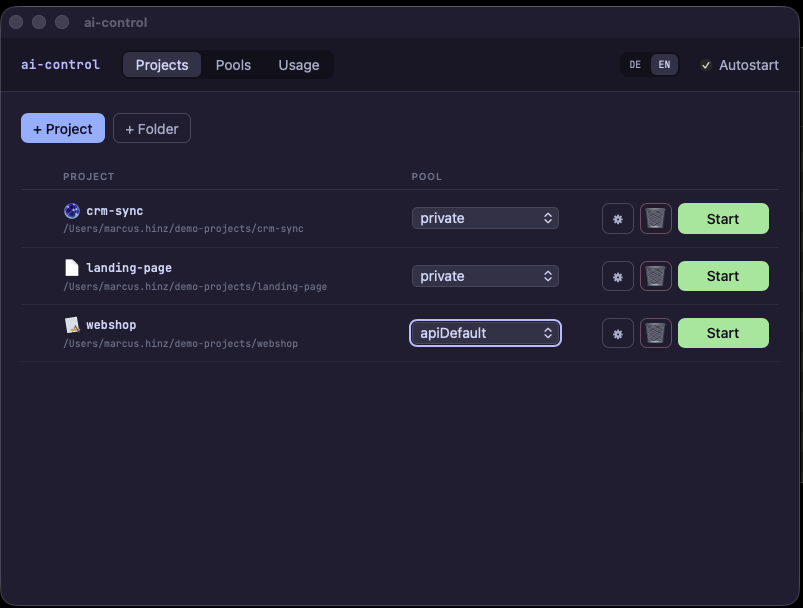

## What it does

- **Several logins, one click apart** — keep separate Claude Code logins side by side (subscription accounts or API keys) and give every project the one it should run under. Each project starts with its own login; no re-login, no juggling environment variables. An existing login in `~/.claude` is picked up as a pool of its own, so nothing has to be set up twice.
- **Command history** — every shell command the assistant hands you lands beside the terminal as a copyable tile, with the session's full command history one click away.
- **Text panel** — Markdown drafts appear next to the terminal instead of scrolling past in the chat: readable, selectable, editable, and copyable in one go.
- **Archive with full-text search** — keep drafts as Markdown files per project, curated with folder, description, and tags; browse them as a wiki and search their full text. A hit says which field it came from, and opening it highlights the findings in the document and scrolls to them — including in the editor, at the spot you were reading.
- **Editors that fit the format** — Markdown as source text with syntax colours, shortcuts, running lists and a table dialog, live preview beside it; HTML notes in a WYSIWYG surface with tables, text flow and per-row delete buttons. JSON, YAML, XML and plain text open in the same editor with their own grammar.
- **What it costs** — tokens and estimated cost per login and project over the last 7 or 30 days, read straight from the session transcripts (retries deduplicated).
- **One click, one session** — the tray popup lists every project with its icon and a green dot when it runs; a click starts it or brings the running terminal to the front.

## How it works

Running Claude Code with multiple accounts or credential sets means hitting the right `CLAUDE_CONFIG_DIR` (plus keychain entry) for every session. aiCentral turns that into clicks:

- **Pools** — named credential sets (OAuth login or API key) under `~/.config/ai-central/pools/<pool>`. Each pool is a self-contained Claude config directory with its own keychain entry. A pool can also *point at* an existing config directory instead: if `~/.claude` is there, it is offered as a pool, keeps its login, and is left otherwise untouched — the app adds panel access there and never deletes anything in it.
- **Projects** — arbitrary directories carrying their own identity in `<project>/.ai-central/config.json` (UUID, display name, terminal settings, archive home — this file syncs with the project). The machine-local registry `~/.config/ai-central/projects.json` maps that UUID to the directory and the assigned pool; paths under home are stored as `~/…` and therefore stable across machines.
- **Sessions** — a built-in terminal per project (xterm.js + PTY) that launches Claude Code with the pool's config directory as `CLAUDE_CONFIG_DIR`. Every terminal runs as its own process — on macOS with its own Dock icon and Cmd-Tab entry, on Linux as its own window with its own app id.
- **Tray** — the app itself is a pure tray app. Clicking the tray icon opens a popup listing all projects with icon and status dot (green = running); clicking a project starts it or brings the running terminal to the front.
- **Text panel** — a workspace beside the terminal with four tabs: command tiles, the current draft, an archive wiki, and archive search. Claude writes into it through a bundled MCP server instead of flooding the chat.
- **Archive** — drafts can be archived as Markdown files into a per-project archive home, curated with folder, description, and tags at archiving time; browsable as a wiki and searchable via full-text search. Notes can also be created there directly — folder, Markdown, HTML, JSON, YAML, XML, plain text — and edited in place. Diagrams live in a hidden `.<note>.res` folder beside their note: out of the file list, and they move and vanish with the note they belong to.
- **Session watcher** — detects the end of a session by the terminal process disappearing and then (opt-in) syncs the Git repository containing the project: add → commit → pull --rebase → push.

## Text panel and MCP tools

The app ships an MCP stdio server (`ai-central --mcp-panel`, server key `text-panel`) and provisions it into every pool, including the tool permission — no per-pool setup. Six tools:

| Tool | Purpose |
|---|---|
| `write_panel` | Place a Markdown draft in the panel instead of printing it as chat prose; accepts inline text or a file path (the server reads the file itself). |
| `write_commands` | List shell commands for the user as copyable tiles (command + optional note), appended to the session's command history. |
| `show_commands` | Show the command history (tile view). |
| `archive_panel` | Save the current draft as a Markdown file into the project's archive home; takes `folder`, `description`, `tags` for the frontmatter. |
| `show_archive` | Render the archive overview as a wiki page — documents grouped by folder, with descriptions and clickable tag links; with `tag`, that tag's page. |
| `search_archive` | FTS5 full-text search over the archive (words, "phrases", prefix*); hits appear as tiles in the panel. |

The panel docks into the terminal window and can be detached into its own window. The header tab bar switches between **Commands** (command tiles), the current **document**, **Wiki**, and **Search** (live search, `#tag` filtering); without a configured archive home the archive tabs stay hidden. The draft's title is taken from its first heading and is editable, as is the content. Spell checking follows `spellcheckLang` (per-text override in the panel).

The archive lives in the project's `archiveHome` (set in `.ai-central/config.json`); documents are plain Markdown files with frontmatter — no database, the search index is built in-memory per query. It covers the note body plus title, description, tags and file name as separate fields, along with the content of text files (JSON, YAML, XML, logs, scripts); `.drawio` diagrams open in the bundled viewer, ePub files in the reader.

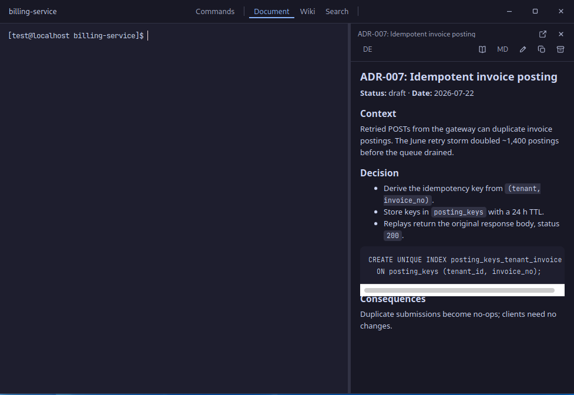

| Command tiles | Archive search |
|---|---|
| 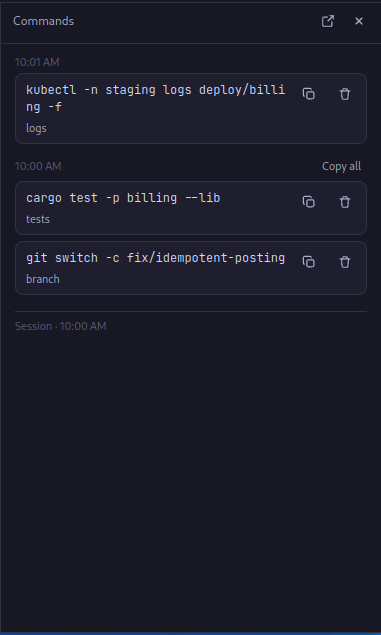 | 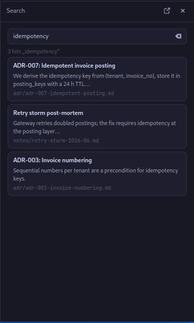 |

The interface speaks English and German across all windows; the language follows the browser locale and can be switched in the app.

## Screenshots

| Pools | Usage |
|---|---|
| 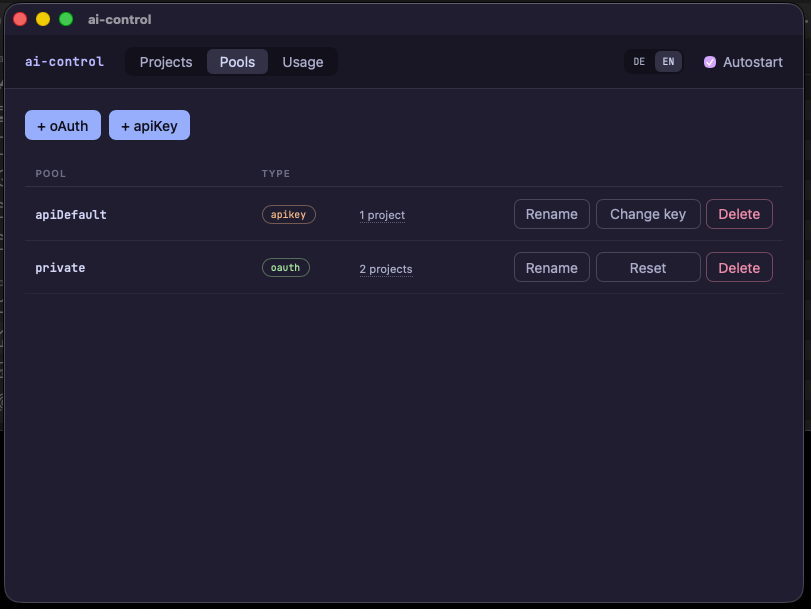 | 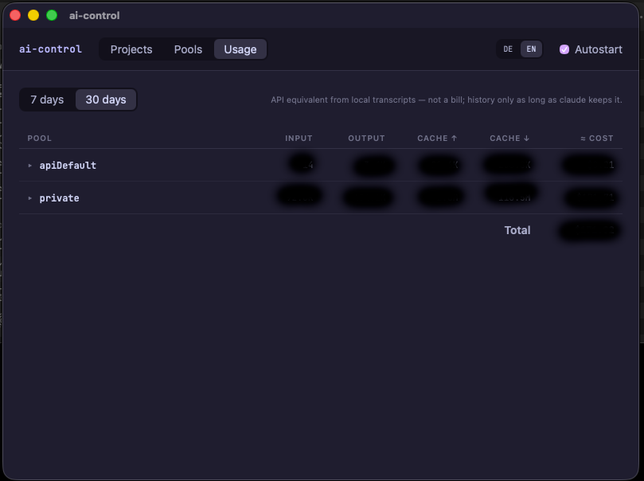 |

| Tray menu | Session terminal |
|---|---|
| 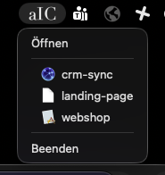 | 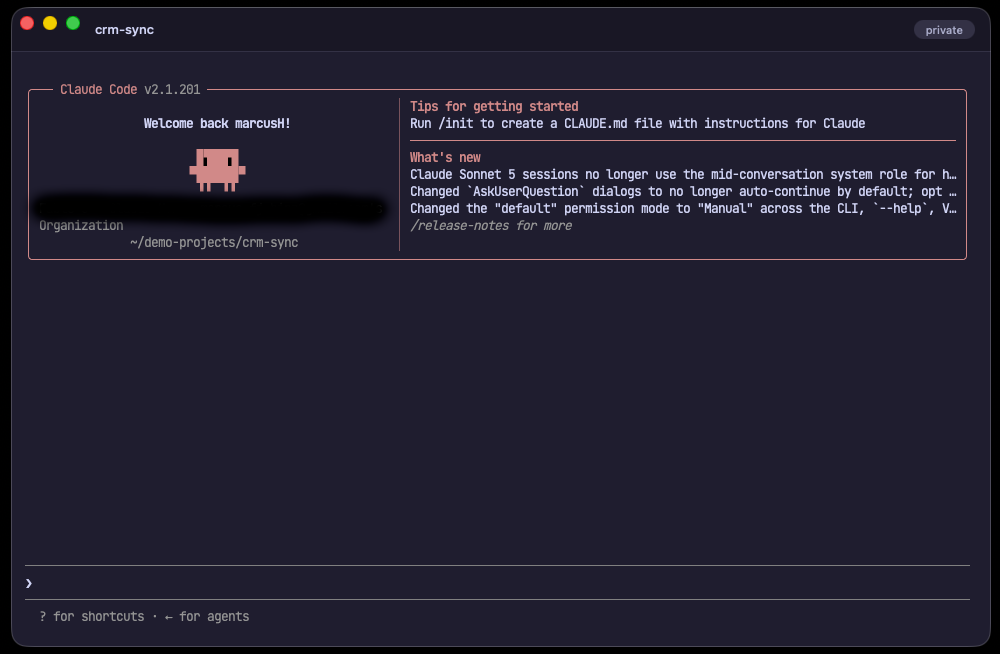 |

| Archive tree | ePub reader |
|---|---|
| 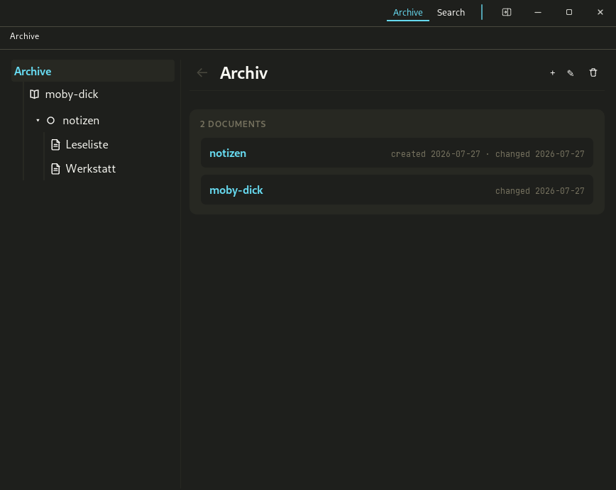 | 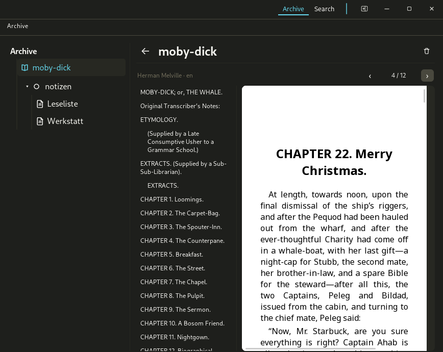 |

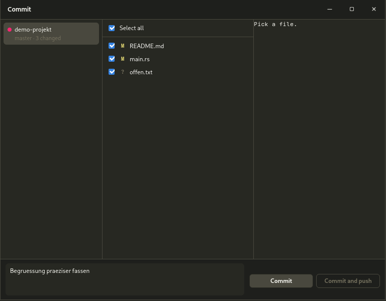

## Installation

### macOS

Prebuilt DMGs are attached to the releases. Open the DMG and drag `ai-central.app` onto the `Applications` shortcut — or drop it into your personal `~/Applications` instead, which works just as well and asks for no administrator password. On first launch from anywhere else (the DMG, your Downloads folder), the app offers to move itself to `~/Applications` and restarts from there.

The bundles are **not signed or notarized** — an Apple Developer ID costs €99/year, which this project doesn't have. If you'd like to change that: [Buy me a coffee](https://buymeacoffee.com/marcusH). macOS quarantines the unsigned download; clear it with whichever path you installed to:

```sh
xattr -d com.apple.quarantine /Applications/ai-central.app     # or
xattr -d com.apple.quarantine ~/Applications/ai-central.app
```

Without the terminal: double-click the app, dismiss the warning, then open **System Settings → Privacy & Security**. Near the bottom of that page macOS now offers *Open Anyway* for the app it just blocked — click it and confirm. The warning is gone for good afterwards.

Or avoid the topic entirely and build from source (below) — self-built apps aren't quarantined.

### Linux

Releases carry a `.deb` and an `.rpm`. Both install three desktop-integration pieces alongside the app: the **GNOME Shell extension** `ai-central-popup@local` (tray button + popup on GNOME, `/usr/share/gnome-shell/extensions/`), the **Cinnamon extension** `ai-central-popup@local` (popup placement on Wayland, initial focus on X11, `/usr/share/cinnamon/extensions/`), and the **KWin script** `ai-central-popup` (popup placement on KDE Wayland, `/usr/share/kwin/scripts/`).

Tray integration by desktop: GNOME via the bundled shell extension, KDE Wayland via StatusNotifierItem plus the bundled KWin script for popup placement, KDE X11/XFCE/Cinnamon via StatusNotifierItem directly. On Cinnamon the bundled extension additionally places the popup at the tray icon on **Wayland** (a Wayland client cannot position its own window) and gives it initial focus on **X11** (Muffin's focus-stealing prevention would otherwise drop it).

The app **enables the matching piece automatically** on each start, per user and without prompting: GNOME via `gnome-extensions enable`, Cinnamon via the `org.cinnamon enabled-extensions` gsettings key, KDE via `kwriteconfig6` + KWin reconfigure. Cinnamon and KDE pick the change up immediately. GNOME Shell only scans for newly installed extensions at session start, so right after the very first package install the enable call can come too early — the tray button then appears after the next login; from then on it is always active.

| Tray popup on GNOME | Tray popup on Cinnamon |
|---|---|
| 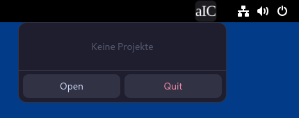 | 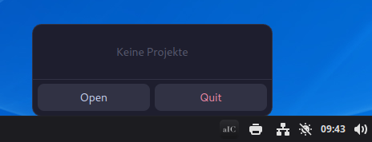 |

### Installer tests

The installers are hand-tested per release. For 0.4.0 the rpm was installed over the previous version on all four VMs of the test fleet — Fedora 44 with GNOME (Wayland), KDE Plasma (Wayland), Cinnamon and XFCE — and each one checked for tray icon, popup placement, terminal window, archive tree, ePub reader and commit dialog. The renamed paths were verified along the way: `~/.config/ai-central`, the project's `.ai-central/` folder, the `AI_CENTRAL_*` environment, and the GNOME extension enabling itself on first start. Ubuntu 26.04 (GNOME), Kubuntu (KDE Plasma, Wayland) and Linux Mint (Cinnamon) were covered via deb in earlier rounds.

Not covered in this round: Cinnamon on **Wayland**. The fleet's Cinnamon guest logs in through gdm autologin, which starts the X11 session — the Wayland path of the bundled Cinnamon extension (popup placement, where a client cannot position its own window) was last verified in the 0.3.0 round.

### Windows

Follows.

## Architecture

One binary, three process roles:

- **Main app** (`ai-central`) — tray, main window, management, session watcher.
- **Terminal process** (`ai-central --terminal <project>`) — one window with its own PTY; launches Claude Code in the project directory with the assigned pool's config directory. On macOS it carries its own Dock icon and Cmd-Tab entry, on Linux its own app id and `.desktop` file.
- **MCP server** (`ai-central --mcp-panel`) — stdio server started by Claude Code itself; no GUI.

Running projects are recognised by their terminal processes (`pgrep` for `--terminal <project>`) — there is no state file that could go stale.

**One look, every platform.** Windows are frameless and draw their own header as the title bar, styled from theme variables: macOS keeps the traffic lights as an overlay, Linux gets its own window buttons. The tray popup is the same HTML window everywhere — what differs is only how the click arrives and who places the window.

**Placement follows a contract.** `show_popup` is a single code path; where the popup lands is decided by the anchor the tray integration hands it:

| Anchor | Where it comes from | Placement |
|---|---|---|
| `IconRect` | native tray (macOS, Windows) | popup's right edge at the tray icon — below the menu bar, above the taskbar |
| `Click` | StatusNotifierItem (KDE, XFCE, Cinnamon) | at the activate coordinates when the host supplies usable ones, otherwise at the pointer, clamped into the monitor |
| `Managed` | GNOME shell extension, KWin script, Cinnamon extension | the compositor places the window itself |

GNOME has no tray at all, so the bundled shell extension provides the icon and relays the click over D-Bus. On Wayland a window cannot position itself, which is why KDE and Cinnamon get a small script/extension for that job.

**Linux, honestly:** desktop × session type (X11/Wayland) × tray host is a wide matrix, and no release can test all of it. What was tested is listed under [Installer tests](#installer-tests). On an untested combination the popup works, but its first placement may sit somewhere other than at the tray icon.

## Security model

- **CSP** — the WebViews run under `default-src 'self'`; scripts, styles, and connections are limited to the app itself and the Tauri IPC endpoint (dev mode additionally allows the Vite dev server and inline styles for hot reload). `style-src` carries no `unsafe-inline`: the window styles live in their own CSS files rather than in the HTML heads, so the policy holds without an exception.
- **Per-window capabilities, deny-by-default** — four capability files, one per window group: `main` (management, broadest command set), `popup` (list/start projects only), `term-*` (PTY plus docked panel), `panel-*` (panel/archive channels only — no PTY, no management). A backend command is callable only from windows whose capability lists it.
- **Pools separate configuration, not access** — keychain entries are deliberately readable without a prompt; any process running as your user can read any pool key. No isolation promise is made or implied.

## Project deletion

Deleting a project is scoped in three stages, each preceded by a preview of the affected artifacts (integration files, archive permission, todo hook, panel files, archive documents, working directories):

1. **Integration only** — removes ai-central's traces: `.ai-central/`, registry entry, panel/session files, archive permission, todo hook, desktop file. The project itself stays untouched.
2. **+ Archive** — additionally deletes the archive home with its documents.
3. **Full** — additionally deletes the project directory (working directories only with an explicit extra flag).

## Project layout

```
├── index.html            main UI (project/pool management)
├── terminal.html         terminal window (xterm.js) + docked text panel
├── panel.html            detached text panel window
├── popup.html            tray popup
├── src/                  frontend: Vue 3 + TypeScript
│                         (incl. wiki-view, search-view, archive-form,
│                         commands-view, md-editor, html-editor
│                         + vitest tests)
├── src-tauri/
│   ├── src/lib.rs        entry point, process roles
│   ├── src/app.rs        Tauri wiring: tray, main/popup windows, watcher
│   ├── src/mcp.rs        MCP stdio server (6 tools, see above)
│   ├── src/terminal.rs   PTY sessions (portable-pty), terminal windows
│   ├── src/domain/       registry, project config, settings, watcher,
│   │                     deletion scopes
│   ├── src/platform/     macOS / Linux / Windows specifics
│   ├── capabilities/     per-window ACL (main/popup/terminal/panel)
│   └── icons/            app and tray icons
├── gnome-shell-extension/  tray/popup integration for GNOME
├── cinnamon-extension/     popup placement for Cinnamon Wayland
├── kwin-script/            popup placement for KDE Wayland
├── dev.sh                development mode (tauri dev)
├── build.sh              release build for the current OS (see below)
├── deploy-linux.sh       install the freshest local bundle (rpm/deb)
└── deploy-macos.sh       install the fresh .app into ~/Applications
```

The three process roles that binary takes are described under [Architecture](#architecture).

## Tooling

| Area      | Stack |
|-----------|-------|
| Shell     | Tauri 2 (Rust) |
| Frontend  | Vue 3, TypeScript, Vite; vitest (happy-dom) for the panel views |
| Editors   | CodeMirror 6 (Markdown, JSON, YAML, XML), ProseMirror (HTML notes) |
| Terminal  | xterm.js, portable-pty |
| macOS     | objc2 / objc2-app-kit (Dock icon, window focus, tray) |
| Linux     | GTK 3 / WebKitGTK, ksni (StatusNotifierItem), zbus (D-Bus) |
| Secrets   | keyring (macOS Keychain / Secret Service) |

## Development

```sh
./dev.sh              # tauri dev with hot reload
./build.sh            # release build for the current OS
./deploy-macos.sh     # …then install it (pick the script for your OS)
```

`build.sh` picks the bundles by platform: macOS `.app` + DMG, Linux deb + rpm. Installing is the job of the matching deploy script:

- **`deploy-macos.sh`** — installs the fresh bundle into `~/Applications` (replacing the previous copy) and registers it with Launch Services. The build output is then moved into `bundle/macos.noindex/` and unregistered, so Spotlight and the launcher only ever find the installed copy. It refuses to run while `ai-central` is still running.
- **`deploy-linux.sh`** — installs the freshest local bundle via `rpm`/`dpkg`.

Build dependencies on Linux: `webkit2gtk-4.1`, `libgtk-3`, `libayatana-appindicator3`, `librsvg2`, `patchelf`.

Prerequisites: Rust (stable), Node.js/npm. `dev.sh`/`build.sh` expect `CARGO_HOME`/`RUSTUP_HOME` under `~/tools/` — adjust the two exports in the scripts for a standard installation.

## Configuration layout

```
~/.config/ai-central/
├── settings.json                 app settings (see below)
├── projects.json                 registry: project UUID → directory
│                                 + pool assignment (machine-local)
└── pools/<pool>/                 one Claude config directory per pool
    └── pool.json                 name + credential type

<project directory>/              any path, mapped via the registry
├── .claude/                      Claude Code project configuration
└── .ai-central/                  syncs with the project
    ├── config.json               project id (UUID), display name,
    │                             terminal settings (theme, icon, title),
    │                             archive home (archiveHome)
    └── icon.png                  project icon
```

### settings.json

| Key                | Default  | Meaning |
|--------------------|----------|---------|
| `claudeCommand`    | `claude` | Command launched in the project terminal (via your login shell, `$SHELL -lc`, so your profile PATH applies). |
| `syncOnSessionEnd` | `false`  | After a session ends, commit and push the Git repository containing the project. |
| `poolSyncDir`      | unset    | Directory to sync pool runtime data into (session transcripts, todos, prompt history — what `/resume` needs). When set, a pool's runtime files are replaced by symlinks into `<poolSyncDir>/<pool>`, so sessions travel with however that directory is synced (git, Syncthing, …). Unset: everything stays local in the pool directory. |
| `terminalFontSize` | `13`     | Font size of the built-in terminal (also adjustable from the terminal window). |
| `spellcheckLang`   | `de`     | Spell-check language of the text panel (per-text override in the panel). |

## Claude and Anthropic

Two things to be clear about:

- **No connection to Anthropic.** aiCentral is an independent open-source project — not affiliated with, sponsored by, endorsed by, or in any way associated with Anthropic. Claude and Claude Code are trademarks of Anthropic and are named here solely to describe what this app works with.
- **No effect on your licence or your usage.** aiCentral organises config directories; it does not touch, extend, replace, or circumvent Anthropic's terms, and it grants no access of its own. Whatever you may do with Claude Code, you may do through aiCentral — no more, no less. Every request runs under your own login against your own subscription or API key, exactly as it would without this app.

The app stores no OAuth tokens itself: with an OAuth pool, the first session of a project on that pool goes through the regular Anthropic login (`/login`, browser, against your subscription), run by Claude Code itself. Credentials live where Claude Code puts them — in the macOS Keychain or the freedesktop Secret Service, one entry per pool.

API keys go into the keychain as well (one entry per pool). Only when no keychain/keyring is available does the app offer — after an explicit confirmation — to store the key as a file in the pool directory (mode 0600). We strongly advise against that fallback: an API key on disk is readable by every process running as your user. Use the keychain.

## License

[MIT](LICENSE)
